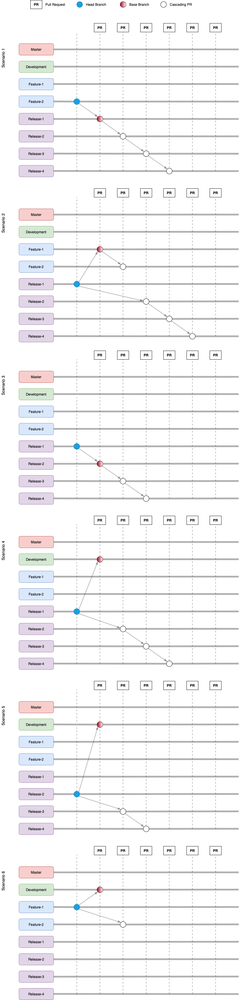

# probot-auto-merge-2.0

This is an extended version of the open source [probot-auto-merge](https://github.com/bobvanderlinden/probot-auto-merge), it supports Cascading Release Merges based on semantic versioning

A detailed description of the `cascading auto-merge` feature can be found [here](cascading-auto-merge.md).

## TOC

- [Requirements](#Requirements)
- [Development](#Development)
  - [Setup](#Setup)
- [Deployment](#Deployment)
  - [Permissions](#Permissions)
  - [Events](#Events)
- [Configuration](#Configuration)
  - [Parameters](#Parameters)
    - [minApprovals](#minApprovals)
    - [maxRequestedChanges](#maxRequestedChanges)
    - [blockingLabels](#blockingLabels)
    - [requiredLabels](#requiredLabels)
    - [blockingTitleRegex](#blockingTitleRegex)
    - [requiredBodyRegex](#requiredBodyRegex)
    - [reportStatus](#reportStatus)
    - [updateBranch](#updateBranch)
    - [deleteBranchAfterMerge](#deleteBranchAfterMerge)
    - [mergeMethod](#mergeMethod)
    - [mergeCommitMessage](#mergeCommitMessage)
    - [rules](#rules)
    - [prefixes](#prefixes)
- [Contributing](#Contributing)
- [Appendix](#Appendix)
  - [OpenSource-Contribution](#OpenSource-Contribution)

---

## Requirements

In order setup and activate this GitHub application we need to complete 3 steps.

1. [Configure the GitHub App](https://github.com/apps/probot-auto-merge). These are the standandard documentation steps for any GitHub App.
2. Create `.github/auto-merge.yml` in your repository.
3. Customize configuration to your needs. See the [Configuration](#Configuration) section.

## Development

To get started with the application, clone this Repository to your local host and follow the _"Setup"_ steps.

### Setup

In side the Repository (the one you just cloned), run the following commands.

```sh
# Install App dependencies (found in package.json)
npm install

# Compile the Typescript code
npm run build

# run some unit tests
npm run test
```

After these steps the Application should be ready for use.

### Running

Start the application, to continue with the registration of the App in GitHub.

For documentation on GitHub Apps see [configuring-a-github-app](https://probot.github.io/docs/development/#configuring-a-github-app)

This is a combined command of the previous steps.

```sh
npm run build && npm run dev
```

<details>
  <summary>Sample result</summary>

```sh
> ~/projects/probot-auto-merge-2.0  npm run dev

> probot-auto-merge@0.0.0-development dev /Users/jefeish/projects/probot-auto-merge-2.0
> nodemon --exec "npm start"

[nodemon] 2.0.2
[nodemon] to restart at any time, enter `rs`
[nodemon] watching dir(s): *.*
[nodemon] watching extensions: js,mjs,json
[nodemon] starting `npm start`

> probot-auto-merge@0.0.0-development start /Users/jefeish/projects/probot-auto-merge-2.0
> probot run ./lib/index.js

18:14:08.245Z  INFO probot: Forwarding https://smee.io/NV8Ot5SvDcjz93 to http://localhost:3000/
18:14:08.248Z  INFO probot: Listening on http://localhost:3000
18:14:08.484Z  INFO probot: Connected https://smee.io/NV8Ot5SvDcjz93
```

</details>

Your application should now be running and ready for installion (register) as an Application in GitHub.

### Running on Docker

> NOTE: Only look at this section if you want to run the GitHub App as a Docker container. Otherwise just use the _regular_ setup. Otherwise skip to _[Deployment](#Deployment)_

This will build and run the app on a container called `probot-auto-merge`:

Build the Docker container (all)

```sh
npm run docker
```

To just build the container image:

```sh
npm run docker:build
```

To run the built image:

```sh
npm run docker:run
```

---

## Deployment

After you finished the _Development_ section and your App is running on your local host, you can now install/register the App in GitHub. Below are the details like configuration and permissions.

Please follow [the guidelines defined by probot on deploying GitHub applications](<https://probot.github.io/docs/deployment/>), as the next steps.

The permissions and events needed for the app to function can be found below.

### Permissions

- Administration: Read-only
- Checks: Read & write
- Contents: Read & write
- Issues: Read & write
- Metadata: Read-only
- Pull requests: Read & write
- Commit statuses: Read-only
- Members: Read-only

### Events

- Check run
- Check suite
- Label
- Pull request
- Pull request review
- Pull request review comment
- Status

---

## Configuration

This is the last step to enable a Repository for use with the _Cascading-Auto-Merge_ Application.

The configuration of probot-auto-merge is done through `.github/auto-merge.yml` in your repository. An example of this file can be found in [auto-merge.example.yml](auto-merge.example.yml).
You can also see the configuration for this repository [here](.github/auto-merge.yml).

Summarize the Steps

- Create a `.github/auto-merge.yml` file in your Repository (the one you want to use with the App).
- Copy the content of _auto-merge.example.yml_ into the `.github/auto-merge.yml`

The configuration has values that serve as conditions on whether or not a pull request
should be automatically merged and also configuration about the merge itself. Values
that serve as conditions are annotated as such below.

All conditions must be met before a PR will be automatically merged. You can get more
flexibility by defining multiple rules. Rules can have multiple conditions and if any
of the conditions inside a rule are met, the PR is also merged. See ['Rules'](#Rules).

Note that the default configuration options are to do nothing. This is to prevent
implicit and possibly unintended behavior.

---

## Parameters

### minApprovals

(required, condition)

The minimum number of reviews from each association that approve the pull request before
doing an automatic merge. For more information about associations see:
<https://developer.github.com/v4/enum/commentauthorassociation/>

Possible associations: `OWNER`, `MEMBER`, `COLLABORATOR`, `CONTRIBUTOR`, `FIRST_TIMER`, `FIRST_TIME_CONTRIBUTOR`, `NONE`

In the example below when a pull request gets 2 approvals from owners, members or collaborators,
the automatic merge will continue.

```yaml
minApprovals:
  COLLABORATOR: 2
```

In the example below when a pull request gets 1 approval from an owner OR 2 approvals from members, the automatic merge will continue.

```yaml
minApprovals:
  OWNER: 1
  MEMBER: 2
```

---

### maxRequestedChanges

(condition, default: none)

Similar to `minApprovals`, maxRequestedChanges determines the maximum number of
requested changes before a pull request will be blocked from being automatically
merged.

It yet again allows you to configure this per association.

Note that `maxRequestedChanges` takes presedence over `minApprovals`.

In the example below, automatic merges will be blocked when one of the owners, members
or collaborators has requested changes.

```yaml
maxRequestedChanges:
  COLLABORATOR: 0
```

In the example below, automatic merges will be blocked when the owner has
requested changes or two members, collaborators or other users have requested
changes.

```yaml
maxRequestedChanges:
  OWNER: 0
  NONE: 1
```

The default for this value is:

```yaml
maxRequestedChanges:
  NONE: 0
```

---

### blockingLabels

(condition, default: none)

Blocking labels are the labels that can be attached to a pull request to make
sure the pull request is not being merged automatically.

In the example below, pull requests that have the `blocked` label will not be
merged automatically.

```yaml
blockingLabels:
- blocked
```

Note: remove the whole section when you're not using blocking labels.

---

### requiredLabels

(condition, default: none)

Whenever required labels are configured, pull requests will only be automatically
merged whenever all of these labels are attached to a pull request.

In the example below, pull requests need to have the label `merge` before they
will be automatically merged.

```yaml
requiredLabels:
- merge
```

Note: remove the whole section when you're not using required labels.

---

### blockingTitleRegex

(condition, default: none)

Whenever a blocking title regular expression is configured, pull requests that have a title
matching the configured expression will not be automatically merged.

This is useful whenever pull requests with `WIP` in their title need to be skipped.

In the example below, pull requests with the word `wip` in the title will not be
automatically merged. This also includes `[wip]`, `WIP` or `[WIP]`, but not `swiping`:

```yaml
blockingTitleRegex: '\bWIP\b'
```

---

### requiredBodyRegex

(condition, default: none)

Whenever a required body regular expression is configured, only pull requests that have a body
matching the configured expression will automatically be merged.

This is useful for forks, that can only create pull request text, no labels.

In the example below, pull requests with the body containing `ok-to-merge` will be
automatically merged. This also includes `labels: ok-to-merge`, `LABELS: OK-TO-MERGE` or `some more text, but ok-to-merge`, but not `not-ok-to-merge`:

```yaml
requiredBodyRegex: '(^|\\s)ok-to-merge($|\\s)'
```

---

### reportStatus

(default: `false`)

The status of the auto-merge process will be shown in each PR as a [check](https://help.github.com/articles/about-status-checks/). This can be especially useful to find out why a PR is not being merged automatically.

To enable status reporting, add the following to your configuration:

```yaml
reportStatus: true
```

---

### updateBranch

(default: `false`)

Whether an out-of-date pull request is automatically updated.
It does so by merging its base on top of the head of the pull request.
This is similar to the behavior of the 'Update branch' button.

`updateBranch` is useful for repositories where protected branches are used
and the option *Require branches to be up to date before merging- is enabled.

Note that this only works when the branch of the pull request resides in the same
repository as the pull request itself.

In the example below automatic updating of branches is enabled:

```yaml
updateBranch: true
```

---

### deleteBranchAfterMerge

(default: `false`)

Whether the pull request branch is automatically deleted.
This is the equivalent of clicking the 'Delete branch' button shown on merged
pull requests.

Note that this only works when the branch of the pull request resides in the same
repository as the pull request itself.

In the example below automatic deletion of pull request branches is enabled:

```yaml
deleteBranchAfterMerge: true
```

---

### mergeMethod

(default: `merge`)

In what way a pull request is merged. This can be:

- `merge`: creates a merge commit, combining the commits from the pull request on top of
  the base of the pull request (default)
- `rebase`: places the commits from the pull request individually on top of the base of the pull request
- `squash`: combines all changes from the pull request into a single commit and places the commit on top
  of the base of the pull request

For more information see <https://help.github.com/articles/about-pull-request-merges/>

```yaml
mergeMethod: merge
```

---

### mergeCommitMessage

(default: none)

Optionally specify the merge commit message format. The following template tags
are supported:

- `{title}`: The pull request title at the moment it is merged
- `{body}`: The pull request body at the moment it is merged
- `{number}`: The pull request number
- `{branch}`: The name of the source branch
- `{commits}`: A list of merged commits

When this option is not set, the merge commit message is controlled by
GitHub and uses a combination of the title of the pull request when it was
opened (note that later changes to the title are ignored) and a list of
commits.

This settings is ignored when `mergeMethod` is set to `rebase`.

```yaml
mergeCommitMessage: |
  {title} (#{number})
  {body}
```

---

### rules

(default: none)

Rules allow more flexiblity configuring conditions for automatically merging. Each rule is defined by
multiple conditions. All conditions inside a rule must be met before a rule triggers a merge. Any of the
defined rules can trigger a merge individually.

An example of a configuration with 2 rules that will trigger a merge upon 1 approval from an owner *or- a `merge` label:

```yaml
rules:
- minApprovals:
    OWNER: 1
- requiredLabels:
    - merge
```

This can be combined with conditions on global level, as the global conditions will take presedence. The following example will not trigger a merge when a PR has the `blocking` label, regardless what the rules say:

```yaml
blockingLabels:
- blocking
rules:
- minApprovals:
    OWNER: 1
- requiredLabels:
    - merge
```

---

### prefixes

(default: none)

Enhancement to support Cascading Auto-Merge of 'named' branches

Define the 'prefix' targets that the cascading auto-merge will 'trigger' on.

Sample branch names:

- release/1.0.1.rc.1 (prefix = `release`)
- feature/1.0.2 (prefix = `feature`)

Some Notes:

- In order for this to function properly the 'deleteBranchAfterMerge' parameter should be set to 'false'
- Protect the branch from un approved merging, since that could prevent this app from triggering the auto-merge

```yaml
prefixes:
- bugfix
- feature
- hotfix
- release
```

---

## Contributing

If you have suggestions for how probot-auto-merge could be improved, or want to report a bug, open an issue! We'd love all and any contributions.

For more, check out the [Contributing Guide](CONTRIBUTING.md).

## Appendix

### Pull-Request-Scenarios

[Sample PR Scenarios (image)](images/cascading-auto-merge-branch-strategy.png)

<details>
  <summary>Sample PR Scenarios Preview</summary>



</details>

---

### OpenSource-Contribution

Since this solution is based on the open source `probot-auto-merge`, we might want to consider contributing the code back to that project.
If we decide to do that, here are some pointers on what needs to be *ported*.

Here is a list of the components / files that contain the code and need to be looked at.

| Files | Description |
|---|---|
| [src/cascading-branch-merge.ts](src/cascading-branch-merge.ts) | This contains the main components |
| [src/pull-request-handler.ts](src/pull-request-handler.ts) | This calls the `cascading-branch-merge.ts` code |
| [src/config.ts](src/config.ts) | This defines the `prefixes` parameter, used in `.github/auto-merge.yml` |

---

## License

[ISC](LICENSE) © 2018 Bob van der Linden <bobvanderlinden@gmail.com> (<https://github.com/bobvanderlinden/probot-auto-merge>)
